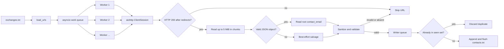

# Asynchronous Sellers.json Contact Extractor

Fetches a list of sellers.json endpoints concurrently, extracts each document's root-level `contact_email`, normalizes and deduplicates the results, and appends the resulting contact list to disk without allowing an individual failed endpoint to terminate the run.

[](LICENSE)
[](https://www.python.org/)
[](https://docs.aiohttp.org/)

This repository is a focused command-line data-extraction utility for publicly published [IAB Tech Lab sellers.json](https://iabtechlab.com/sellers-json/) documents. It is intentionally small: the input and output are newline-delimited text files, and operational behavior is controlled by constants near the top of `extract_contacts.py` rather than by a package-level configuration system.

> [!IMPORTANT]
> Only request and use contact information in accordance with applicable law, the policies of the originating services, the sellers.json publisher's terms, and your organization's privacy and acceptable-use requirements. The checked-in `contacts.txt` file contains contact addresses that were published by third parties; treat it as potentially sensitive operational data.

## Table of Contents

- [Features](#features)
- [Tech Stack & Architecture](#tech-stack--architecture)
  - [Project Structure](#project-structure)
  - [Data Flow](#data-flow)
  - [Key Design Decisions](#key-design-decisions)
- [Getting Started](#getting-started)
  - [Prerequisites](#prerequisites)
  - [Installation](#installation)
  - [Troubleshooting](#troubleshooting)
- [Testing](#testing)
- [Deployment](#deployment)
- [Usage](#usage)
  - [Basic Usage](#basic-usage)
  - [Input Format](#input-format)
  - [Output Format](#output-format)
  - [Advanced Usage and Edge Cases](#advanced-usage-and-edge-cases)
- [Configuration](#configuration)
  - [Configuration Sources](#configuration-sources)
  - [Runtime Constants](#runtime-constants)
  - [HTTP and Transport Settings](#http-and-transport-settings)
  - [Input and Output Semantics](#input-and-output-semantics)
- [License](#license)
- [Contacts & Community Support](#contacts--community-support)
  - [Support the Project](#support-the-project)

## Features

- **Asynchronous bulk retrieval** using `asyncio` and `aiohttp`, allowing many independent sellers.json endpoints to be processed without creating one operating-system thread per request.
- **Configurable high concurrency** with 100 asynchronous workers by default.
- **Per-host fairness** through an `aiohttp` connector limit of eight simultaneous connections per host, while retaining a global connection limit of 100.
- **DNS-throughput protection** using a dedicated 300-thread default executor. This prevents slow or dead DNS lookups from exhausting asyncio's small default executor when many URLs are processed at once.
- **Connection and request deadlines** with a ten-second total timeout and a ten-second connection timeout.
- **Redirect support** with `allow_redirects=True`, followed by validation of the final response status.
- **Bounded response reads** in 64 KiB chunks with a nominal five-megabyte per-URL payload ceiling. This protects the process from accidentally buffering arbitrarily large responses.
- **Root-level field extraction** that reads only `contact_email` from a JSON object. Seller records nested under `sellers` are not individually traversed.
- **Malformed-document tolerance** through a fallback extractor that can recover a root-level email from some truncated JSON documents.
- **Defensive decoding** using UTF-8 with replacement for invalid byte sequences and removal of a leading UTF-8 byte-order mark.
- **Email normalization** that trims whitespace, lowercases the value, removes a leading `mailto:` scheme, strips common surrounding punctuation, and applies a conservative syntax check.
- **Duplicate suppression** within the current run and against values already present in `contacts.txt`.
- **Durable incremental output**: each newly accepted email is written and flushed immediately in append mode, so useful progress remains on disk if the run is interrupted.
- **Failure isolation**: HTTP errors, timeouts, TLS/transport errors, malformed JSON, invalid values, and unexpected per-URL exceptions are skipped rather than stopping the worker pool.
- **Comment- and blank-line support** in the input file. Lines beginning with `#` and empty lines are ignored.
- **Proxy/environment integration** through `aiohttp.ClientSession(trust_env=True)`, which permits the HTTP client to use supported proxy environment variables and local network settings.
- **Low operational overhead**: the project has no database, message broker, web service, build system, or generated code requirement.
- **Progress visibility** through `tqdm` while URLs are being processed.
- **A standards-oriented user agent** identifying the extractor and linking to the sellers.json specification.

## Tech Stack & Architecture

| Layer | Technology | Responsibility |
| --- | --- | --- |
| Runtime | Python 3.10 or newer | Application runtime; the source uses modern type-union and generic syntax. |
| Concurrency | `asyncio` | Event loop, queues, task lifecycle, and cooperative scheduling. |
| HTTP client | `aiohttp` | Async HTTP sessions, connection pooling, redirects, timeouts, streaming response reads, and proxy-aware transport. |
| DNS execution | `concurrent.futures.ThreadPoolExecutor` | Expands the event loop's default executor for concurrent hostname resolution. |
| Progress UI | `tqdm.asyncio` | Terminal progress display. |
| Parsing and validation | Python standard library (`json`, `re`, `ssl`, `pathlib`) | JSON parsing, email-shape validation, filesystem paths, and exception handling. |
| Persistence | UTF-8 newline-delimited text files | URL input and append-only normalized email output. |

There is no framework, installable Python package, database layer, or public HTTP API. `extract_contacts.py` is both the application entry point and the implementation module.

### Project Structure

```text
.
├── extract_contacts.py  # Async extractor, sanitization, queues, and CLI entry point
├── exchanges.txt        # Newline-delimited sellers.json URLs to process
├── contacts.txt         # Normalized, deduplicated contact_email values
├── cmd_commands.txt     # Original quick-start command reference
├── LICENSE              # Apache License 2.0
└── README.md            # Project documentation
```

`exchanges.txt` and `contacts.txt` are data files, not generated build artifacts. Their contents represent a point-in-time collection and can become stale as endpoints change. Replace or update them deliberately before a production run.

### Data Flow

<details>
<summary>View the request, parsing, and persistence pipeline</summary>



At startup, existing non-empty output lines are loaded into an in-memory set. Each worker fetches one URL at a time and places only a successfully sanitized email onto the writer queue. A single writer task owns file writes, making deduplication and append operations deterministic without concurrent file handles.

</details>

### Key Design Decisions

1. **One shared session and connector**: workers reuse a single `ClientSession`, which enables connection pooling and avoids the cost of creating a new session for every URL.
2. **Two queues, one writer**: the work queue decouples URL scheduling from network completion, while the writer queue prevents concurrent workers from racing over output-file writes.
3. **Concurrency is bounded twice**: the worker count/global connector limit prevents unlimited in-flight requests, and `limit_per_host=8` reduces the chance of concentrating the full workload on one origin.
4. **DNS gets its own capacity**: `aiohttp` hostname resolution is dispatched through the event loop's default executor. The program replaces that executor with 300 threads because hundreds of dead or slow domains can otherwise make DNS the bottleneck.
5. **Streaming is bounded, not zero-copy**: the response is read incrementally, but the bytes for each response are still accumulated in memory before decoding. At the default limits, a pathological workload can have many buffers resident at once; lower `CONCURRENCY` or `MAX_BYTES` when memory is constrained.
6. **Best-effort extraction over strict batch failure**: the tool is intended for heterogeneous third-party endpoints. A single unavailable host, non-JSON response, or malformed document is treated as a miss rather than as a fatal batch error.
7. **Append-and-flush persistence**: appending allows a later run to retain previous discoveries, and immediate flushing reduces data loss after an interruption. The existing output set also makes reruns idempotent for already-known email values.
8. **Source-level configuration**: the repository favors a small, auditable script over a configuration framework. There are currently no command-line flags, `.env` loader, YAML/JSON settings file, or retry policy.
9. **Transport compatibility over TLS assurance**: the connector is instantiated with `ssl=False`, which disables certificate verification for HTTPS connections. This is an important security trade-off in the current implementation and should be changed before using the utility in an environment that requires authenticated TLS.

> [!WARNING]
> `TCPConnector(ssl=False)` means HTTPS server certificates are not verified. Do not interpret a successful HTTPS connection as proof that the response came from the intended origin. If certificate validation is required, change this setting to the default verified behavior and test the complete input set before deployment.

## Getting Started

### Prerequisites

- **Python 3.10 or newer**. Python 3.10 is the minimum because the source uses syntax such as `str | None` and built-in generic type annotations.
- **`pip`** or another Python package installer.
- **Outbound network and DNS access** to the hosts listed in `exchanges.txt`, unless a supported proxy is configured.
- **Filesystem write permission** for the working directory, because the program appends to `contacts.txt`.
- A terminal capable of displaying ordinary text output. A progress bar is optional from a functional perspective, but `tqdm` is a runtime dependency.

The project does not require Node.js, Docker, a database, a compiler, or a cloud service for local execution.

### Installation

Clone the repository and create an isolated virtual environment:

```bash
git clone https://github.com/adops-tool/async-sellers-json-contact-extractor.git
cd async-sellers-json-contact-extractor

python3 -m venv .venv
source .venv/bin/activate
python -m pip install --upgrade pip
python -m pip install aiohttp tqdm
```

Run the extractor from the repository root so the relative paths `exchanges.txt` and `contacts.txt` resolve correctly:

```bash
python extract_contacts.py
```

The original quick-start equivalent is also valid when the active Python environment is already selected:

```bash
pip install aiohttp tqdm
python extract_contacts.py
```

On Windows PowerShell, activate the environment with:

```powershell
.\.venv\Scripts\Activate.ps1
python -m pip install --upgrade pip
python -m pip install aiohttp tqdm
python .\extract_contacts.py
```

A normal run prints an initial queue summary and a completion summary similar to:

```text
[i] 1,307 URLs queued | 627 emails already on disk
[✓] Done. 12 new unique emails written to contacts.txt
[✓] Total unique emails on disk: 639
```

The exact counts depend on the current input file, endpoint availability, and the existing output file.

### Troubleshooting

<details>
<summary>Installation and execution troubleshooting</summary>

#### `externally-managed-environment` or permission errors from `pip`

Use a virtual environment as shown above. Some Linux distributions prevent writes to the system Python installation under PEP 668. Do not work around that protection by modifying the system interpreter when a project-local virtual environment is available.

```bash
rm -rf .venv                         # only if you want to recreate it
python3 -m venv .venv
. .venv/bin/activate
python -m pip install aiohttp tqdm
```

#### `ModuleNotFoundError: No module named 'aiohttp'`

Install dependencies with the same interpreter that will run the script:

```bash
python -m pip install aiohttp tqdm
python -c "import aiohttp, tqdm; print('dependencies available')"
```

Using `python -m pip` avoids accidentally installing into a different Python executable.

#### `Input file not found: exchanges.txt`

The paths are relative to the process's current working directory, not relative to the source file. Change into the repository root before running the command, or place the expected input file in the directory from which Python is launched.

#### `No URLs to process.`

The input file is missing usable lines. Empty lines and lines whose first non-whitespace character is not relevant after `.strip()` are ignored only when they begin with `#`; every other non-empty line is passed to `aiohttp`. Verify that the file contains one complete URL per line.

#### Many URLs produce zero emails

The program silently skips non-200 responses, connection failures, timeouts, invalid JSON, missing root-level `contact_email`, and values that fail validation. Check a small sample independently with `curl` or a browser, confirm DNS/proxy access, and inspect whether the endpoint actually exposes `contact_email` at the JSON root. The extractor does not log a per-URL failure reason.

#### Corporate proxy, firewall, or restricted network

Because the session uses `trust_env=True`, configure the proxy according to `aiohttp` and the environment used by the process. Common variables include `HTTP_PROXY`, `HTTPS_PROXY`, `ALL_PROXY`, and `NO_PROXY`.

```bash
export HTTPS_PROXY=http://proxy.example.test:8080
export HTTP_PROXY=http://proxy.example.test:8080
export NO_PROXY=localhost,127.0.0.1
python extract_contacts.py
```

Do not put proxy credentials into a committed README, shell history, or repository file.

#### The process uses too much memory

Each response is buffered in memory up to approximately five megabytes, and up to 100 requests can be active. Lower `CONCURRENCY` and/or `MAX_BYTES` in `extract_contacts.py`, then run a representative sample before processing the full list. The implementation is bounded per response but does not impose an explicit global byte budget.

#### The terminal output looks noisy or the progress bar is not rendered

`tqdm` uses carriage-return terminal updates. Redirected or non-interactive output may display multiple progress lines; this does not change extraction behavior. The program intentionally raises the logging threshold for asyncio/aiohttp transport loggers and installs a quiet event-loop exception handler.

</details>

## Testing

The repository currently contains no automated test suite, test directory, test runner configuration, linter configuration, or CI workflow. The commands below provide practical syntax, dependency, helper-function, and end-to-end checks without implying that a test framework is already part of the project.

### Syntax and dependency checks

Run these from the repository root:

```bash
python --version
python -m py_compile extract_contacts.py
python -c "import aiohttp, tqdm; print('aiohttp and tqdm imported successfully')"
```

`py_compile` verifies that the source parses and can be compiled; it does not contact any endpoint or validate runtime behavior.

### Unit-level smoke check

The pure helper functions can be exercised without making network requests:

```bash
python - <<'PY'
from pathlib import Path
from tempfile import TemporaryDirectory

from extract_contacts import load_urls, sanitize_email

assert sanitize_email("  MAILTO:Ops@Example.COM, ") == "ops@example.com"
assert sanitize_email("not-an-email") is None
assert sanitize_email(None) is None
assert sanitize_email("a" * 250 + "@example.com") is None

with TemporaryDirectory() as directory:
    path = Path(directory) / "urls.txt"
    path.write_text("https://one.example/sellers.json\n# ignored\n\nhttps://two.example/sellers.json\n", encoding="utf-8")
    assert load_urls(path) == [
        "https://one.example/sellers.json",
        "https://two.example/sellers.json",
    ]

print("helper smoke checks passed")
PY
```

### Integration smoke check

The full integration path is the production command itself. It exercises DNS resolution, the `aiohttp` connector, asynchronous workers, JSON parsing, sanitization, deduplication, progress reporting, and append/flush output behavior:

```bash
python extract_contacts.py
```

Because this command contacts third-party hosts and modifies `contacts.txt`, use a disposable working copy when validating changes to the extractor:

```bash
workdir="$(mktemp -d)"
cp extract_contacts.py exchanges.txt "$workdir/"
: > "$workdir/contacts.txt"
(
  cd "$workdir"
  python extract_contacts.py
)
rm -rf "$workdir"
```

For deterministic integration tests, point a small local HTTP fixture at a temporary `exchanges.txt` and include responses for a valid JSON object, a non-200 status, malformed JSON, an oversized body, a missing `contact_email`, and a duplicate email. The implementation accepts `http://` URLs, so no local certificate setup is necessary for such a fixture. No fixture server is included in this repository.

### Linting and static checks

No linter is mandated by the repository. `ruff` is a lightweight optional check:

```bash
python -m pip install ruff
ruff check extract_contacts.py
```

A project adopting a stricter policy can add a pinned `ruff` configuration and run it in CI. Until then, treat the compile check as the baseline validation and do not expect a `pytest`, `flake8`, or `mypy` command to discover tests/configuration automatically.

> [!NOTE]
> A successful run is not a completeness guarantee. Unreachable endpoints, non-200 responses, malformed documents, and invalid contact values are intentionally omitted, and the current program does not emit a failure report for those URLs.

## Deployment

This is a batch command-line utility rather than a long-running service. A production deployment should schedule an isolated process, provide a controlled input snapshot, preserve the output artifact, and record the run's operational metadata outside the extractor if auditability is required.

### Recommended production procedure

1. Pin the Python runtime and dependency versions in the deployment environment. The repository currently lists dependencies by name rather than providing a lock file or `requirements.txt`.
2. Copy or mount a reviewed `exchanges.txt` snapshot into the working directory.
3. Decide whether `contacts.txt` should be cumulative. The default behavior is cumulative append plus in-memory deduplication against existing lines.
4. Review the transport security setting before deployment. In particular, decide whether the current `ssl=False` behavior is acceptable for your threat model.
5. Apply an outbound-request policy appropriate for the publishers being contacted. The default concurrency is aggressive for some networks; lower it when required.
6. Run under a service account with only the filesystem permissions required to read the input and write the output.
7. Back up or version the output file if results are part of an operational workflow. The program itself does not write a timestamped run manifest or failure report.
8. Monitor process exit status and stdout/stderr externally. The script exits with status 1 when the input file is absent, exits successfully with no work for an empty input, and otherwise generally skips per-URL failures.

### Building from source

There is no compilation step. The source checkout is the deployable artifact:

```bash
python -m venv .venv
. .venv/bin/activate
python -m pip install --upgrade pip
python -m pip install aiohttp tqdm
python extract_contacts.py
```

### Optional container image

The repository does not include a Dockerfile. The following minimal example can be used as a starting point; review the Python base image, dependency pinning, filesystem permissions, and network policy before using it in production:

```dockerfile
FROM python:3.11-slim

WORKDIR /app
COPY . /app

RUN python -m pip install --no-cache-dir aiohttp tqdm

CMD ["python", "extract_contacts.py"]
```

Build and run it with the repository mounted so the output survives container removal:

```bash
docker build --tag sellers-json-contact-extractor:local .
docker run --rm \
  --mount "type=bind,src=$PWD,dst=/app" \
  sellers-json-contact-extractor:local
```

The container needs outbound DNS and HTTP/HTTPS access. If the host uses a proxy, pass only the required proxy variables explicitly, for example with `-e HTTPS_PROXY` and `-e NO_PROXY`; avoid baking secrets into the image.

### CI/CD integration

There is no CI workflow in the current repository. A conservative pipeline should run deterministic checks on every change and keep the network-dependent extraction job separate or manually approved. For example:

```yaml
name: Validate

on:
  pull_request:
  push:
    branches: [main]

jobs:
  checks:
    runs-on: ubuntu-latest
    steps:
      - uses: actions/checkout@v4
      - uses: actions/setup-python@v5
        with:
          python-version: "3.11"
      - run: python -m pip install --upgrade pip aiohttp tqdm ruff
      - run: python -m py_compile extract_contacts.py
      - run: ruff check extract_contacts.py
      - run: |
          python - <<'PY'
          from extract_contacts import sanitize_email
          assert sanitize_email("MAILTO:Ops@Example.com") == "ops@example.com"
          assert sanitize_email("invalid") is None
          print("smoke checks passed")
          PY
```

Do not make a public pull-request validation job fetch the entire third-party URL list unless network access, rate limits, data handling, and nondeterministic failures have been explicitly addressed.

## Usage

### Basic Usage

1. Put one sellers.json URL on each line of `exchanges.txt`.
2. Activate the environment containing `aiohttp` and `tqdm`.
3. Run the script from the directory containing both data files:

```bash
python extract_contacts.py
```

The script reads the complete input queue, fetches URLs concurrently, and appends new normalized values to `contacts.txt`. It does not accept positional arguments or command-line options in the current implementation.

### Input Format

`exchanges.txt` is a UTF-8 text file with one URL per line:

```text
https://example-exchange.test/sellers.json
https://another-exchange.test/path/sellers.json
# This comment is ignored

http://legacy-exchange.test/sellers.json
```

Leading and trailing whitespace is removed. Blank lines and lines beginning with `#` after stripping are ignored. Input URLs are not deduplicated or syntactically validated before enqueueing; malformed or unsupported entries are later skipped by the HTTP client.

The expected useful response is a JSON object with a root-level string field named `contact_email`:

```json
{
  "contact_email": "ads@example-publisher.test",
  "version": "1.0",
  "sellers": [
    {
      "seller_id": "pub-123",
      "seller_type": "PUBLISHER",
      "name": "Example Publisher",
      "domain": "example-publisher.test"
    }
  ]
}
```

The parser does not require a particular `Content-Type` header, but it does require a final HTTP status of exactly `200` and a value that passes the extractor's normalization rules.

### Output Format

`contacts.txt` contains one normalized email address per line:

```text
ads@example-publisher.test
ops@example-exchange.test
sellers.json@another-exchange.test
```

Output behavior is intentionally append-oriented:

- Existing non-empty lines are loaded and lowercased into the initial `seen` set.
- New values are normalized before deduplication.
- A value already on disk or already emitted during the current run is not written again.
- Every accepted new value is written with a trailing newline and flushed immediately.
- Output ordering follows completion order, not input-file order, because requests finish asynchronously.
- The file is opened with UTF-8 encoding and append mode (`a`).

### Advanced Usage and Edge Cases

<details>
<summary>Read the detailed extraction, failure, and extension behavior</summary>

#### Sanitization rules

`sanitize_email()` accepts only string values. It then:

1. Trims leading/trailing whitespace and lowercases the value.
2. Removes a leading `mailto:` prefix, then trims again.
3. Removes surrounding angle brackets, quotes, spaces, tabs, line breaks, commas, and semicolons.
4. Rejects values shorter than five characters or longer than 254 characters.
5. Applies the regular expression `^[a-zA-Z0-9_.+-]+@[a-zA-Z0-9-]+\.[a-zA-Z0-9-.]+$`.

This is deliberately a practical shape check, not full RFC email validation. Internationalized addresses, quoted local parts, domain literals, and other valid-but-unusual forms can be rejected. Conversely, a syntactically plausible address is not proof that the mailbox exists.

#### JSON scope and salvage behavior

For valid JSON, the parser requires a top-level object and evaluates only `data.get("contact_email")`. It does not search nested objects, inspect each seller record, or infer an address from a domain. A non-string value such as `null`, an array, or an object is rejected.

If `json.loads()` fails, `_salvage_contact_email()` searches the decoded text for the first literal `"contact_email"`, the next colon, and the next pair of double quotes. This can recover an email that appears early in a truncated document, but it is intentionally not a full JSON parser. It can fail with escaped quotes, unusual whitespace/layout, duplicate keys, or a value containing quotes. Treat salvaged values as best effort.

#### Payload size and response handling

Responses are read in 64 KiB chunks until the accumulated buffer reaches `MAX_BYTES` (5 MiB by default). The check occurs after a chunk is added, so one final chunk can make the in-memory buffer slightly larger than the nominal limit. If the resulting text is truncated and no salvageable root-level contact is available, the URL is skipped.

The response `Content-Length` header is not trusted, and the `Content-Type` header is not enforced. Redirects are followed, but only a final status of exactly `200` is accepted. There is no retry, exponential backoff, circuit breaker, or per-URL failure report.

#### Reruns and interruption recovery

The writer opens `contacts.txt` in append mode and loads existing non-empty lines before work begins. This means a rerun will not duplicate previously stored normalized emails, even though it will request every URL in `exchanges.txt` again. The input queue is not checkpointed, so a process interrupted during network work starts the URL scan from the beginning on the next run.

Because each accepted email is flushed immediately, completed writes generally survive a process interruption. A single writer task avoids interleaved lines, but an abrupt machine or filesystem failure can still lose the most recent buffered operating-system write.

To intentionally start a fresh collection, preserve the old output first and then truncate the file:

```bash
cp contacts.txt contacts.backup.txt
: > contacts.txt
python extract_contacts.py
```

#### Importing helper functions

The module can be imported by another Python program after dependencies are installed. The `main()` function still uses the module-level paths and constants; there is no stable package API or dependency-injection layer.

```python
from pathlib import Path

from extract_contacts import load_urls, sanitize_email

urls = load_urls(Path("exchanges.txt"))
normalized = sanitize_email("mailto:Sales@Example.com;")
print(f"loaded {len(urls)} URLs; normalized contact: {normalized}")
```

To embed the network workflow, call or refactor the async functions (`fetch_email`, `worker`, and `writer_task`) with an application-owned session, queues, and paths. Review exception policy and TLS settings before treating those functions as a library interface.

#### Extending the script

The current script has no command-line parser or custom formatter abstraction. Typical extensions include:

- replace `INPUT_FILE` and `OUTPUT_FILE` with `argparse` options;
- move constants into a typed settings object;
- add structured failure reporting alongside `contacts.txt`;
- add retry/backoff with publisher-friendly rate limits;
- change `ssl=False` to verified TLS or a controlled custom `SSLContext`;
- write a CSV/JSON Lines output in a separate writer implementation; or
- add a local test server and deterministic tests for each response class.

Keep any custom output writer single-owner or otherwise synchronized; allowing all network workers to write directly to the same file would undermine the current deduplication and durability guarantees.

</details>

## Configuration

Configuration is currently source-based. Edit the constants in `extract_contacts.py`, then run the script again; changes are not read from a configuration file or command-line arguments.

### Configuration Sources

| Source | Supported | Details |
| --- | --- | --- |
| Module constants | Yes | Primary configuration mechanism; edit `extract_contacts.py`. |
| Command-line flags | No | `python extract_contacts.py --help` is not implemented. |
| `.env` file | No | The script does not load `.env` files. |
| JSON/YAML/TOML file | No | No settings-file parser is included. |
| Environment variables | Partially | `aiohttp` can use proxy-related environment settings because `trust_env=True`; application constants are not populated from environment variables. |
| Python API arguments | Partially | Lower-level async functions accept objects such as sessions and queues, but `main()` has no public configuration object. |

### Runtime Constants

<details>
<summary>View the complete module-level configuration table</summary>

| Constant | Default | Meaning and operational impact |
| --- | ---: | --- |
| `INPUT_FILE` | `Path("exchanges.txt")` | Relative path read by `main()` for newline-delimited source URLs. |
| `OUTPUT_FILE` | `Path("contacts.txt")` | Relative append-only path for normalized contact emails. |
| `CONCURRENCY` | `100` | Number of worker tasks and global connector limit. Lower this for constrained networks or memory. |
| `DNS_THREADS` | `300` | Maximum workers in the event loop's replacement default `ThreadPoolExecutor`, primarily for hostname resolution. |
| `MAX_BYTES` | `5 * 1024 * 1024` | Nominal maximum response buffer per URL. The read loop uses 64 KiB chunks. |
| `TIMEOUT_SECONDS` | `10` | Used for both `ClientTimeout(total=...)` and `ClientTimeout(connect=...)`. |
| `QUEUE_SENTINEL` | `None` | Internal marker used to stop workers and the writer; it is not user input. |
| `USER_AGENT` | `SellersJsonExtractor/1.0` product string | HTTP `User-Agent` identifying the client and linking to the sellers.json specification. |
| `EMAIL_RE` | Conservative ASCII-oriented regex | Shape filter applied after normalization. |

</details>

Changing `CONCURRENCY` also changes the global `TCPConnector(limit=...)` and the number of worker tasks. `DNS_THREADS` is intentionally larger than the request concurrency in the default configuration; blindly increasing both can create unnecessary memory and scheduler pressure.

### HTTP and Transport Settings

The following values are configured directly when `main()` creates the session:

| Setting | Current value | Behavior |
| --- | --- | --- |
| `ClientTimeout.total` | `10` seconds | Upper bound for the complete request operation. |
| `ClientTimeout.connect` | `10` seconds | Upper bound for connection establishment. |
| `TCPConnector.limit` | `CONCURRENCY` (`100`) | Maximum simultaneous connections across all hosts. |
| `TCPConnector.limit_per_host` | `8` | Maximum simultaneous connections for one host/endpoint pool. |
| `TCPConnector.ssl` | `False` | Disables TLS certificate verification; review before production use. |
| `TCPConnector.ttl_dns_cache` | `300` seconds | Reuses DNS results for five minutes. |
| `TCPConnector.enable_cleanup_closed` | `True` | Enables aiohttp cleanup handling for closed transports. |
| Redirects | Enabled | `session.get(..., allow_redirects=True)` follows redirects. |
| Proxy trust | Enabled | `ClientSession(trust_env=True)` reads supported environment proxy settings. |
| `Accept` header | `application/json,text/plain,*/*` | Expresses a preference for JSON/text while tolerating broad server behavior. |

There is no response retry policy. If a publisher rate-limits the client, returns a transient 5xx response, or is temporarily unreachable, that URL is skipped for that run.

### Input and Output Semantics

<details>
<summary>View the file formats, normalization contract, and failure policy</summary>

#### Input

- Read with UTF-8 encoding and `errors="ignore"`.
- One stripped URL per non-empty, non-comment line.
- Duplicate source URLs are retained and can be fetched more than once.
- No scheme, host, or path validation occurs before enqueueing.

#### Successful response

- Final response status must be `200`.
- The body is decoded as UTF-8 with replacement and a leading BOM removed.
- Valid JSON must be a dictionary/object.
- Only its root-level `contact_email` key is considered.
- The value must be a string accepted by `sanitize_email()`.

#### Failure handling

The URL produces no output for a non-200 status, timeout, `aiohttp.ClientError`, SSL/transport error, OS error, invalid JSON without a salvageable email, non-object JSON, missing key, non-string value, or invalid email shape. The exception is intentionally swallowed at the per-URL boundary, so the rest of the batch continues.

#### Output

- Read existing output using UTF-8 with `errors="ignore"`.
- Existing non-empty lines are compared case-insensitively after lowercasing, but are not rewritten or repaired.
- New values are appended using UTF-8 text mode with line buffering and an explicit `flush()` after each line.
- `writer_task()` returns the number of new values written in the current run.
- There is no source URL, timestamp, response status, or failure reason in the output format.

</details>

## License

This project is distributed under the **Apache License, Version 2.0**. See [`LICENSE`](LICENSE) for the complete license text and the terms governing use, reproduction, modification, and distribution.

## Contacts & Community Support

## Support the Project

[](https://www.patreon.com/OstinFCT)
[](https://ko-fi.com/fctostin)
[](https://boosty.to/ostinfct)
[](https://www.youtube.com/@FCT-Ostin)
[](https://t.me/FCTostin)

If you find this tool useful, consider leaving a star on GitHub or supporting the author directly.
